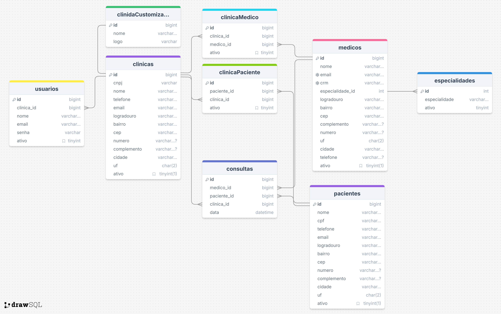

# 💻 Projeto de Banco de Dados para Gestão de Clínicas Médicas

Este projeto consiste em um banco de dados modelado para o gerenciamento de clínicas médicas, incluindo o cadastro e relacionamento entre clínicas, médicos, pacientes, especialidades e consultas. A ideia é fornecer uma base sólida para um sistema de gerenciamento clínico, permitindo a realização de consultas complexas que ajudem na gestão do dia a dia da clínica.

## 💡 Visão Geral

O banco de dados foi desenvolvido em MySQL e contém as seguintes entidades principais:

- **Clínicas**: Informações da clínica (CNPJ, endereço, contato, etc.)
- **Pacientes**: Dados completos de pacientes (CPF, telefone, endereço, contato).
- **Médicos**: Dados de médicos (CRM, especialidade, endereço, contato).
- **Especialidades**: Tipos de especialidades médicas (Cardiologia, Pediatria, etc.).
- **Consultas**: Agendamentos de consultas entre médicos e pacientes.
- **Usuários**: Possível cadastro de usuários do sistema.
- **Tabelas de relacionamento**:
  - `clinicas_pacientes` para ligar pacientes às clínicas.
  - `clinicas_medicos` para ligar médicos às clínicas.
  - `clinica_customizacao` para customizações específicas de cada clínica.

O projeto inclui scripts SQL para:

- Criação do esquema do banco (`init.sql`): Tabelas, chaves primárias, estrangeiras e índices.
- Inserção de dados (`insert_dados.sql`): Popula as tabelas com dados de exemplo.
- Consultas (`querys.sql`): Exemplo de queries para atender a diversos cenários de listagem e relatórios.

Além disso, há um diagrama do banco (`drawSQL-image-export-2024-12-10.png`) gerado com o DrawSQL.

## 🛠 Como Executar o Projeto

### Pré-requisitos

- [Docker](https://www.docker.com/) instalado em sua máquina.
- [Docker Compose](https://docs.docker.com/compose/) instalado (geralmente já incluso em versões mais recentes do Docker Desktop).

### Passos para Execução

1. **Clonar o Repositório**:

   ```bash
   git clone https://seu_repositorio.git
   cd seu_repositorio
   ```
2. **🐳Executar o Docker Compose**:

   ```bash
   docker-compose up -d
   ```
3. **Conectar ao MySQL**:

   - **Host**: `localhost`
   - **Porta**: `3306`
   - **Usuário**: `root`
   - **Senha**: `root`
   - **Banco de Dados**: `clinicadb`
4. **Executar os Scripts SQL**:

   - Conecte-se ao MySQL e execute os scripts SQL em ordem:
     1.`insert_dados.sql`
     2.`querys.sql`
5. **Consultar o Banco de Dados**:

   - Utilize um cliente MySQL (Workbench, DBeaver, etc.) ou a linha de comando para executar queries no banco.
   - O arquivo `querys.sql` contém exemplos de consultas para testar o banco.

### ⚙️ Como o Banco Funciona

* O init.sql cria as tabelas e relacionamentos.
* O insert_dados.sql insere dados que permitem testar as consultas.
* O querys.sql mostra exemplos de consultas comuns a um ambiente de gestão clínica.

As tabelas contam com chaves estrangeiras, índices e constraints de unicidade para garantir integridade e otimizar desempenho.

### 🗺️ Diagrama do Banco de Dados


O arquivo drawSQL-image-export-2024-12-10.png mostra um diagrama do modelo relacional,
facilitando a visualização dos relacionamentos entre as tabelas.
